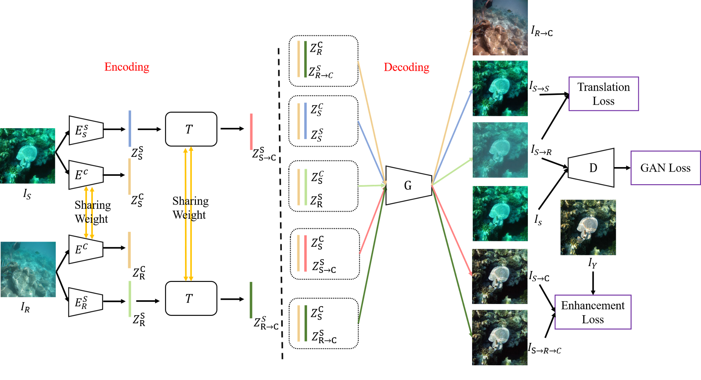

# UIESS

Official Code for the paper [Domain Adaptation for Underwater Image Enhancement via Content and Style Separation](https://arxiv.org/abs/2202.08537).

## Introduction
In this paper, we propose a domain adaptation framework for underwater image enhancement via content and style separation, we assume image could be disentangled to content and style latent, and image could be clustered to the sub-domain of associated style in latent space, the goal is to build up the mapping between underwater style latent and clean one. Different from prior works of domain adaptation for underwater image enhancement, which target to minimize the latent discrepancy of synthesis and real-world data, we aim to distinguish style latent from different sub-domains. To solve the problem of lacking pair real-world data, we leverage synthesis to real image-to-image translation to obtain pseudo real underwater image pairs for supervised learning, and enhancement can be achieved by input content and clean style latent into generator. Our model provide a user interact interface to adjust different enhanced level by latent manipulation. Experiment on various public real-world underwater benchmarks demonstrate that the proposed framework is capable to perform domain adaptation for underwater image enhancement and outperform various state-of-the-art underwater image enhancement algorithms in quantity and quality.
<p align="center">
  
</p>

## Usage
### Prerequisite
```
torch==1.5.1
torchvision==0.6.1
matplotlib==3.2.2
pillow==8.0.1
seaborn==0.10.1
scikit-learn==1.0
```

### File Structure
Download [UIEB dataset](https://li-chongyi.github.io/proj_benchmark.html), [EUVP dataset](http://irvlab.cs.umn.edu/resources/euvp-dataset)

We use underwater-imagenet as synthesis dataset, split the dataset with 90% for training and 10% for test and arrange them in the following format.
```
    UIESS
    ├── data 
    |   ├── trainA # Training, real-world   
    |   |
    |   |      
    |   ├── trainB # Training, synthesis    
    |   |   
    |   |   
    |   └── testA  # Testing, real-world         
    |   |
    |   |             
    |   └── testB  # Testing, synthesis
```

### Testing:
To run testing code. You can pass `--testing` args to run different testing function.
``` python
python test.py --test_dir $image_dir --out_dir $ output_dir --gpu $gpu_id
```
### Training
To run the training code.
```
python train.py --data_root $path_to_dataset_root --gpu $gpu_id
```

### Acknowledgements:
Our code are based on [PyTorch-GAN](https://github.com/eriklindernoren/PyTorch-GAN),
  and some useful functions from
  [DLN](https://github.com/WangLiwen1994/DLN). We thank for contribution to the authors.

**If there are any inconsistent to paper or coding bug, please feel free to raise an issue and let me know.** 
### Citation:

```@ARTICLE{9866748, 
author={Chen, Yu-Wei and Pei, Soo-Chang},
journal={IEEE Access},
title={Domain Adaptation for Underwater Image Enhancement via Content and Style Separation},
year={2022},
volume={10},
number={},
pages={90523-90534},
doi={10.1109/ACCESS.2022.3201555}}
```
